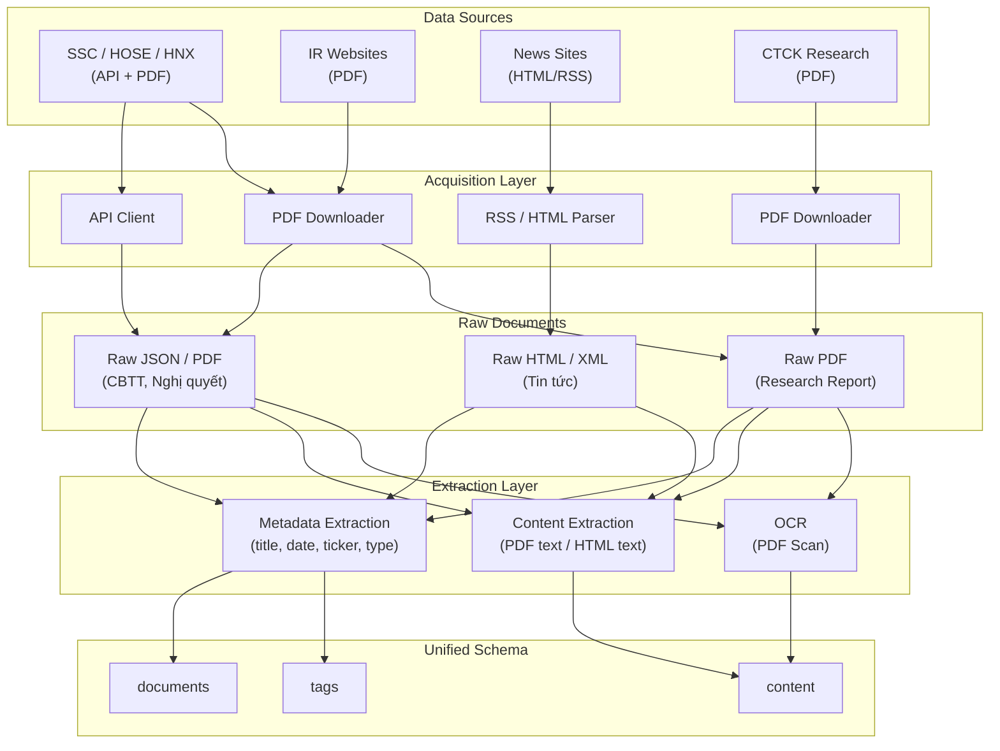

#  Chứng khoán Việt Nam — Unstructured Data Research Guide

> **Giai đoạn:** Khảo sát & Thiết kế Schema
> **Mục tiêu:** Xác định, phân loại, đánh giá pháp lý, và thiết kế schema cho dữ liệu phi cấu trúc trong TTCK Việt Nam.

---

##  Tổng quan Mục tiêu

| # | Mục tiêu | Deliverable |
|---|-----------|-------------|
| 1 | Xác định các loại Unstructured Data | **Data Taxonomy** |
| 2 | Xác định nguồn F0 | **Source Map** |
| 3 | Đánh giá khả năng tiếp cận | **Source Map** |
| 4 | Đánh giá tính pháp lý | **Legal Matrix** |
| 5 | Thiết kế pipeline khái niệm | **Pipeline Diagram** |
| 6 | Thiết kế schema thống nhất | **Unified Schema** |

---

# Phase 1 — Data Discovery

> **Câu hỏi cốt lõi:** *"Trong thị trường chứng khoán Việt Nam có những loại dữ liệu phi cấu trúc nào đáng quan tâm?"*

##  Data Taxonomy

| Data Type | Description | Format | F0 Source | Intermediate Source |
|-----------|-------------|--------|-----------|---------------------|
| **CBTT — Công bố thông tin** | BCTC, giao dịch nội bộ, thay đổi nhân sự, phát hành cổ phiếu, mua bán cổ phiếu quỹ | JSON metadata, PDF attachment | SSC, HOSE, HNX | — |
| **Nghị quyết & Tài liệu họp** | Nghị quyết HĐQT, Nghị quyết ĐHĐCĐ, Tài liệu đại hội | PDF, PDF Scan | Website IR doanh nghiệp, SSC, HOSE, HNX | — |
| **Tin tức** | Kết quả kinh doanh, M&A, thay đổi lãnh đạo, tin ngành | HTML | VnEconomy, Báo Đầu Tư, Người Quan Sát, VietnamBiz | CafeF, Vietstock |
| **Báo cáo phân tích CTCK** | Company Report, Industry Report, Macro Report | PDF | SSI Research, HSC Research, Vietcap Research, MBS Research, KBSV Research | CafeF |

---

# Phase 2 — Source Investigation

> **Câu hỏi cốt lõi:** *"Dữ liệu thực sự nằm ở đâu?"*

##  Công cụ Điều tra

| Công cụ | Mục đích | Ưu điểm | Nhược điểm | Ưu tiên |
|---------|----------|----------|------------|---------|
| **Chrome DevTools** | Xác định API, endpoint, file tải (F12 → Network → Fetch/XHR → Reload) | Miễn phí, dễ học, quan trọng nhất | Thủ công | ★★★★★ |
| **Postman** | Test API | Dễ kiểm tra endpoint, export collection | Không tự động | ★★★★☆ |
| **Bruno** | Thay thế Postman (open source) | Open source, lưu file local | Ít phổ biến | ★★★★☆ |

##  Checklist Điều tra mỗi nguồn

Với mỗi source, cần trả lời:

- [ ] Có **API** không?
- [ ] Có **RSS** không?
- [ ] Có **file tải trực tiếp** không?
- [ ] Có cần **JavaScript** render không?
- [ ] Có **robots.txt** không? (`domain.com/robots.txt`)

##  Source Map

```
SSC ──────────────────────────────── API ──► JSON metadata
                                  └── PDF ──► Attachment (CBTT, BCTC)

HOSE / HNX ──────────────────────── API / HTML ──► CBTT
                                  └── PDF ──► Attachment

Website IR doanh nghiệp ─────────── PDF ──► Nghị quyết, ĐHĐCĐ

SSI / HSC / Vietcap / MBS / KBSV ── PDF ──► Research Report

VnEconomy / Báo Đầu Tư
VietnamBiz / Người Quan Sát ──────── HTML ──► Tin tức

CafeF ────────────────────────────── JSON / HTML ──► Aggregated News
                                  └── PDF (link) ──► Research Report (trung gian)

Vietstock ───────────────────────── HTML / JSON ──► Aggregated News
```

---

# Phase 3 — Legal Review

> **Câu hỏi cốt lõi:** *"Lấy được gì? Lưu được gì? Chia sẻ được gì?"*

##  Cần kiểm tra

- **Terms of Service:** `/terms`, `/dieu-khoan`, `/tos`
- **robots.txt:** `domain.com/robots.txt`

##  Legal Matrix

| Data Type | Crawl | Store | Redistribute | Ghi chú |
|-----------|:-----:|:-----:|:------------:|---------|
| **CBTT** (SSC/HOSE/HNX) |  Có thể |  Có thể |  Có thể | Thông tin công khai theo quy định pháp luật |
| **Nghị quyết / ĐHĐCĐ** |  Có thể |  Có thể |  Cẩn thận | Tài liệu công khai; redistribution tuỳ trường hợp |
| **Tin tức** |  Crawl metadata |  Metadata |  Không nên full-text | Copyright thuộc toà soạn; chỉ crawl metadata / đoạn trích |
| **Báo cáo CTCK** |  Cẩn thận |  Nội bộ |  Không | Có bản quyền CTCK; chỉ dùng nội bộ, không phân phối lại |

### Kết luận pháp lý

**CBTT:**
-  Có thể crawl
-  Có thể lưu
-  Có thể chia sẻ (dữ liệu công khai theo luật chứng khoán)

**Tin tức:**
-  Có thể crawl metadata (title, publish_time, URL, ticker tag)
-  Không nên phân phối lại nguyên văn (vi phạm bản quyền báo chí)

**Báo cáo CTCK:**
-  Crawl có điều kiện (phụ thuộc ToS từng CTCK)
-  Chỉ lưu nội bộ
-  Không redistribution

---

# Phase 4 — Acquisition Strategy

> **Câu hỏi cốt lõi:** *"Nếu triển khai thật thì sẽ lấy như thế nào?"*

> [!IMPORTANT]
> Giai đoạn này **không viết crawler**. Chỉ xác định chiến lược thu thập theo thứ tự ưu tiên.

##  Thứ tự Ưu tiên

| Thứ tự | Phương pháp | Ưu điểm | Nhược điểm | Áp dụng cho |
|--------|-------------|----------|------------|-------------|
| **1** | **API** | Ổn định, structured | Có thể thay đổi endpoint | SSC, HOSE, HNX |
| **2** | **RSS** | Hợp pháp nhất, dễ xử lý | Không có full content | Tin tức (metadata) |
| **3** | **Direct PDF Download** | Không cần parse HTML | Khó tìm link | CBTT attachment, Research Report |
| **4** | **HTML Parsing** | Phổ biến | Dễ vỡ khi site thay đổi | Tin tức, IR website |
| **5** | **Browser Automation** (Playwright/Selenium) | Vượt JavaScript render | Chậm, tốn tài nguyên, khó bảo trì | Chỉ dùng khi bất đắc dĩ |

---

# Phase 5 — Pipeline Design

> **Câu hỏi cốt lõi:** *"Luồng dữ liệu từ nguồn tới schema trông như thế nào?"*

##  Pipeline Diagram



> [!NOTE]
> Không cần triển khai thực tế ở giai đoạn này. Sơ đồ trên mô tả luồng khái niệm.

---

# Phase 6 — Unified Schema Design

> **Nguyên tắc:** Schema thiết kế theo **loại dữ liệu**, không theo **website nguồn**.

> [!CAUTION]
> **Sai:** `cafef_news`, `ssc_news` — thiết kế theo website, khó mở rộng.
> **Đúng:** `documents` — thiết kế theo loại tài liệu, dễ thêm nguồn mới.

##  Schema Tables

### `documents` — Bảng chính

| Column | Type | Description |
|--------|------|-------------|
| `document_id` | UUID / INT PK | Unique identifier |
| `source` | VARCHAR | Tên nguồn (e.g., `SSC`, `VnEconomy`, `SSI_Research`) |
| `source_url` | TEXT | URL gốc của tài liệu |
| `title` | TEXT | Tiêu đề tài liệu |
| `publish_time` | TIMESTAMP | Ngày giờ công bố |
| `ticker` | VARCHAR | Mã cổ phiếu liên quan (nullable) |
| `document_type` | ENUM | Xem bảng Document Types bên dưới |
| `file_type` | VARCHAR | `pdf`, `html`, `json` |
| `language` | VARCHAR | `vi`, `en` |

### `content` — Nội dung văn bản

| Column | Type | Description |
|--------|------|-------------|
| `content_id` | UUID / INT PK | Unique identifier |
| `document_id` | FK → documents | Liên kết đến tài liệu cha |
| `content_text` | TEXT | Nội dung đã trích xuất |
| `ocr_required` | BOOLEAN | True nếu PDF Scan cần OCR |

### `tags` — Nhãn phân loại

| Column | Type | Description |
|--------|------|-------------|
| `document_id` | FK → documents | Liên kết đến tài liệu |
| `tag` | VARCHAR | Nhãn tự do (e.g., `M&A`, `BCTC`, `leadership_change`) |

##  Document Types (ENUM)

| Value | Mô tả |
|-------|-------|
| `CBTT` | Công bố thông tin (HOSE, HNX, SSC) |
| `Resolution` | Nghị quyết HĐQT / ĐHĐCĐ |
| `News` | Tin tức từ báo / trang tài chính |
| `ResearchReport` | Báo cáo phân tích từ CTCK |

---

#  Deliverables Checklist

| Deliverable | Mô tả | Trạng thái |
|-------------|-------|-----------|
| **Data Taxonomy** | Danh sách 4 loại Unstructured Data, format, nguồn F0 |  Phase 1 |
| **Source Map** | Sơ đồ nguồn F0 → phương thức tiếp cận → định dạng |  Phase 2 |
| **Legal Matrix** | Quyền crawl / store / redistribute theo từng loại dữ liệu |  Phase 3 |
| **Pipeline Diagram** | Luồng dữ liệu từ nguồn tới Unified Schema (Mermaid) |  Phase 5 |
| **Unified Schema** | 3 tables: `documents`, `content`, `tags` + Document Types ENUM |  Phase 6 |
